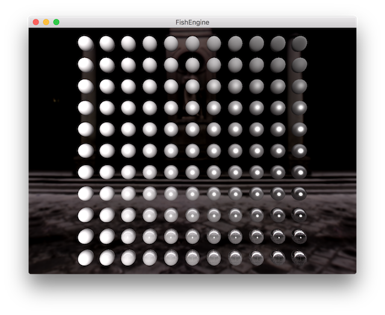

# FishEngine-ECS

FishEngine-ECS(Entity-Component-System) is a simple game engine adapted from [FishEngine](https://github.com/yushroom/FishEngine). 



## How to Build

Supported platforms and compilers:

- Windows10 with VS2017

- OSX(10.12+) with XCode(Clang)

Before your build, you will need to have some additional software installed:

- Git
- [CMake](https://cmake.org/download/)

#### Step 1

```shell
git clone https://github.com/yushroom/FishEngine-ECS.git
cd FishEngine-ECS
mkdir ThirdParty && cd ThirdParty
git clone git://github.com/bkaradzic/bx.git
git clone git://github.com/bkaradzic/bimg.git
git clone git://github.com/bkaradzic/bgfx.git
git clone git://github.com/syoyo/tinygltf.git
git clone git://github.com/glfw/glfw.git
```

#### Step 2

Build bgfx following the [instruction](https://github.com/bkaradzic/bgfx).

Or you can run the script:

```shell
# win10
# double click and run build_3rdparty.bat

# macos
./build_3rdparty.sh
```

#### Step 3

Compile shaders:

```shell
python compile_shader.py
```

Run build script:

```shell
# win10
# double click and run build.bat

# macos
./build.sh
```

The script above is just a combination of basic cmake instructions, you can build with camke as your like.


## 3rd Party Libraries

- [ocornut/imgui](https://github.com/ocornut/imgui)
- [bkaradzic/bgfx](https://github.com/bkaradzic)
- [glfw/glfw](https://github.com/glfw/glfw)
- [syoyo/tinygltf](https://github.com/syoyo/tinygltf)

- [Microsoft/DirectXShaderCompiler](https://github.com/Microsoft/DirectXShaderCompiler)
- [KhronosGroup/SPIRV-Cross](https://github.com/KhronosGroup/SPIRV-Cross)